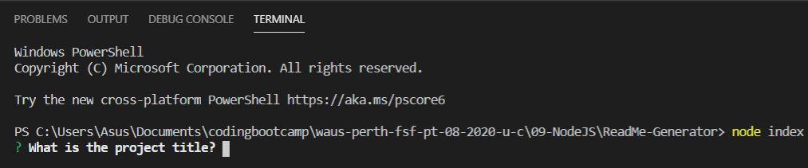
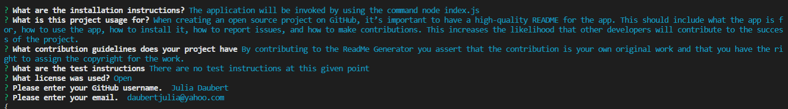
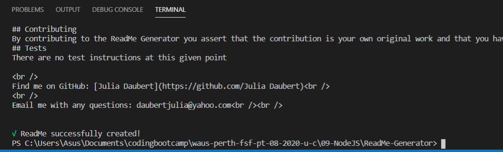

# ReadMe-Generator

This App is quickly and easily generating a README file by using a command line application.

<br>
<br>

## Table of contents

- [General Info](#General-Info)
- [Technologies](#Technologies)
- [Setup](#Setup)
- [Improvement](#Improvement)
- [Walkthrough video](#Walkthrough%20video)

<br>

### General Info

When creating an open source project on GitHub, it’s important to have a high-quality README for the app. This should include what the app is for, how to use the app, how to install it, how to report issues, and how to make contributions. This increases the likelihood that other developers will contribute to the success of the project.
The **Professional Read Me Generator** allows the project creator to devote more time working on the project.

<br>

### Technologies

<ul>
<li>Javascript
<li>Node
<li>JSON
</ul>

<br>

### Setup

The application will be invoked by using the following command:

```
node index.js
```

<br>



<br>

The User will be asked a set of questions including choosing a liscence from a list of choices:



After the User has answered the last question, a ReadMe is created with the name MyReadMe.md.



### Improvement

- No improvments planned at this given time.

### Walkthrough video

[Link to Walkthrough video](https://drive.google.com/file/d/1Bd9kraQ-q4MIWI0BOBnpH0D7f-s7hP7s/preview)
